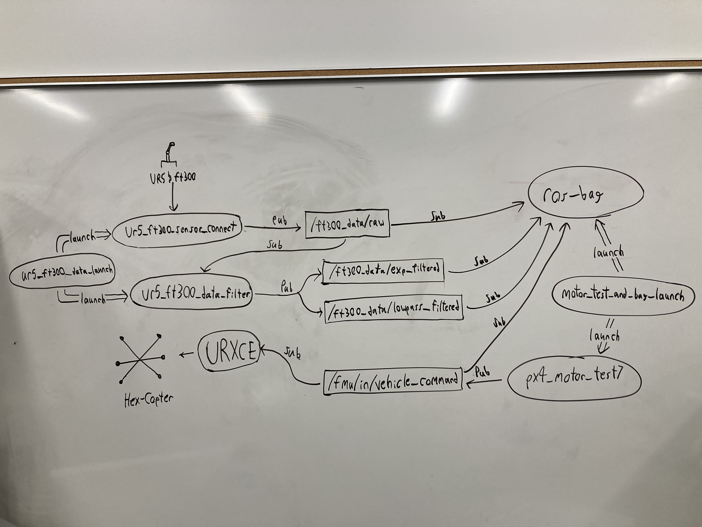

# READ ME

The purpose of this package is to dynamically control a hex-copter drone mounted on a UR5 and measure the wrench forces produced by the drone using the ft300 sensor. 

This diagram shows the relationships between the different components of this package.

## Requirements

You will need to following to run all included code:

- Ubuntu 20.04

- ROS2 Foxy (Python)
    - Workspace
    - Package

- PX4 Workspaces:
    - PX4 Autopilot 
    - MicroXRCE Agent 
    - Sensors Combined workspace

- Plotjuggler for ROS2

## Python Files

This package includes 5 python files: 3 base files and 2 launch files.

### !!! Warning !!!

Please read `motor_test_setup.md`, `ur5_ft300_sensor_setup.md`, `qos_setup.md`, and `Launch_setup.md` before trying 

### Base files

These files are the ones you'll place them into your ROS2 package

> `px4_motor_test7.py`
>
> `ur5_ft300_sensor_connect.py`
>
> `ur5_ft300_data_filter.py`

`px4_motor_test7.py` controls the percent throttle for a certain time. It requires the user to input 2 arguments. One argument takes 6 values representing the throttle of the 6 motors on the hex-copter. The other argument takes a single value that controls the time in seconds that the motor test will last. Read `motor_test_setup.md` for more details.

`ur5_ft300_sensor_connect.py` is used to connect ROS to the ft300 sensor on the UR5. It takes the the raw wrench data and publishes to the topic `/ft300_data/raw`. This code requires setup to work, read `ur5_ft300_sensor_setup.md` for instructions.

`ur5_ft300_data_filter.py` filters the raw wrench data from the topic `/ft300_data/raw`. It uses exponential and lowpass filters, publishing the data to the topics `/ft300_data/exp_filtered` and `/ft300_data/lowpass_filtered` respectively. Read `ur5_ft300_sensor_setup.md` for setup and tuning instructions.

#### RQT Graph:

This RQT graph shows the relationship between the nodes and topics created by the files above.

### Launch Files

These files make it easier to conduct testing by requiring less terminals to run all the required files.

> `motor_test_and_bag_launch.py`
>
> `ur5_ft300_data_launch.py`

`motor_test_and_bag_launch.py` is used to launch `px4_motor_test7.py` and create a ROS bag. The ROS bag records 4 topics:`/ft300_data/raw`, `/ft300_data/exp_filtered`, `/ft300_data/lowpass_filtered`, and `fmu/in/vehicle_command`. This launch takes 3 arguments. One argument takes 6 values representing the throttle of the 6 motors on the hex-copter. Another argument takes a single value that controls the time in seconds that the motor test will last. The last argument takes a file path where the ROS bag data will be stored. Read `Launch_setup.md` for setup and configuration instructions. Also read `qos_setup.md` to correctly configure the qos settings, otherwise the ROS bag may not record the topic `fmu/in/vehicle_command`.

`ur5_ft300_data_launch.py` is used to launch `ur5_ft300_sensor_connect.py` and `ur5_ft300_data_filter.py`. Read `Launch_setup.md` for setup and configuration instructions.

## UR5 FT300 Calibration

The following are instructions on how to calibrate the ft300 sensor:

1. Turn the UR5 on
2. Click `Program Robot`
3. Click `Load Program`
4. Open the `sensors` file (Should be in blue text)
5. Select the `calib_tool.urp` program
6. Click the play button at the bottem of the screen

